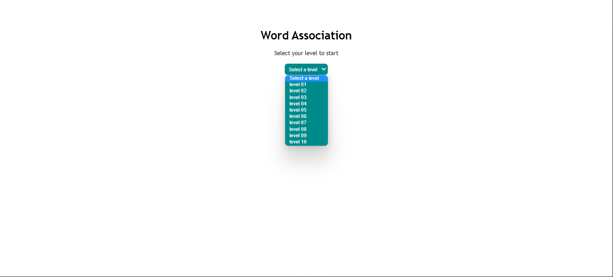
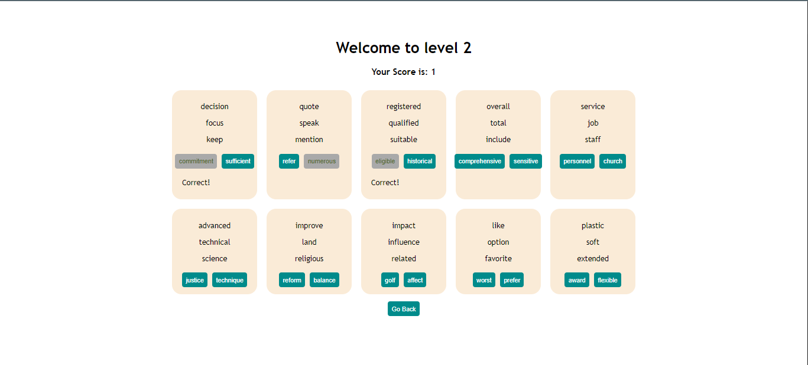

# Word Association Game

# Sobre o projeto: Word Association Game

Dashboard feita seguindo o tutorial do canal [Code with Ania Kubów](https://youtu.be/WDwhJNbWka0?t=8422) onde consumi informações de uma API do marketplace [RapidApi.com](http://rapidapi.com).
- Word Quiz: Teste de vocabulário com termos específicos de exames como SAT, GMAT, etc _(em inglês)_.  
[link aqui](https://rapidapi.com/twinword/api/word-quiz/)  

Nessa word game simples podemos associar termos, fazendo uma pontuação em até 10 níveis de dificuldade.

## Tecnologias
[](https://pt-br.reactjs.org/)  
[](https://nodejs.org/en/)  


## Bibliotecas & Utilitários
  [](https://axios-http.com/)  
  [](https://expressjs.com/)  
  [](https://developer.mozilla.org/en-US/docs/Web/HTTP/CORS)  
  [](https://www.npmjs.com/package/dotenv)  
  [](https://www.npmjs.com/package/nodemon)

# Como executar

## `npm i`
- instale todas as dependências necessárias  


## arquivo `.env`
- crie um arquivo `.env` no `root` do seu projeto e nele insira o seguinte código sem {}:
```bash
REACT_APP_RAPID_API_KEY={sua_chave_api_aqui}
```
❗ _sem essas informação seu código não conseguirá acessar as informações da API_  
🔗 _você encontra sua chave assim que subscrever em alguma API, dentro marketplace [RapidApi.com](http://rapidapi.com)_  
💡 _tutorial (em inglês) de como conseguir sua rapidApiKey: [aqui](https://youtu.be/WDwhJNbWka0)_

## execute: `npm run start:frontend`
- comando roda o aplicativo no mode de desenvolvimento, acesse: http://localhost:3000 no navegador.

## execute: `npm run start:backend`
 - comando inicia o servidor em http://localhost:8000


## Layout Final



